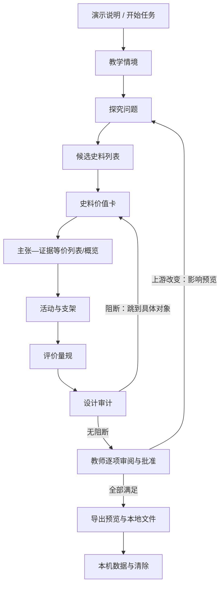

# 原型与设计验证记录

> 原型日期：2026-08-31
> 状态：阶段 5 已批准归档
> 形式：Markdown 流程图、线框、静态高保真 SVG/PNG 与艺术方向图；没有写正式业务代码或安装原型依赖

## 1. 原型目标

验证两类问题：首次使用者能否知道当前该做什么、从阻断安全恢复并区分四种关键状态；以及电影化敦煌首屏能否在带来第一眼惊喜的同时，不阻塞进入任务、不冒充史料、不污染长期阅读工作台。

## 2. 关键流程低保真图



## 3. 桌面线框

```text
┌──────────────────────────────────────────────────────────────────────────────┐
│ 史证工坊   [作品集演示模式]               当前任务 ▾   本机数据            │
├──────────────┬──────────────────────────────────────┬────────────────────────┤
│ 证据脉络带   │ H1 候选史料                          │ 当前史料详情（可选）   │
│ 1 情境 ✓     │ 完成条件：至少选择可核验候选         │ 名称 + 状态文字        │
│ 2 问题 ✓     │ [阻断 1] [待核验 3]                  │ 出处与许可              │
│ 3 史料 当前  │                                      │ 原文与定位              │
│ 4 主张 —     │ 筛选：状态 / 类型 / 权利 / 搜索      │ 加工记录                │
│ 5 活动 —     │ ┌──────────────────────────────────┐ │ 价值与局限              │
│ 6 量规 —     │ │ 候选 A  待核验  权利未知          │ │                        │
│ 7 审计 —     │ │ 来源… 定位… [查看价值卡]          │ │ [保存] [退回核验]      │
│ 8 批准 —     │ └──────────────────────────────────┘ │                        │
│ 9 导出 —     │ ┌──────────────────────────────────┐ │                        │
│              │ │ 候选 B  有条件可用  仅元数据      │ │                        │
│              │ └──────────────────────────────────┘ │                        │
└──────────────┴──────────────────────────────────────┴────────────────────────┘
```

设计意图：右侧详情只在容器足够宽时出现；URL 仍切到详情地址。中等宽度时详情在列表后或独立页，不把三栏压缩。

## 4. 手机线框

```text
┌──────────────────────────────┐
│ 史证工坊   [演示模式]        │
│ 第 3/9 步：候选史料      [∨] │
├──────────────────────────────┤
│ 阻断 1 · 待核验 3            │
│ 完成条件：选择可核验候选     │
│ [筛选，已用 2 项]            │
│ ┌──────────────────────────┐ │
│ │ 候选 A                   │ │
│ │ 待核验 · 权利未知        │ │
│ │ 来源… 定位…              │ │
│ │ [查看价值卡] [排除]      │ │
│ └──────────────────────────┘ │
│ ┌──────────────────────────┐ │
│ │ 候选 B                   │ │
│ │ 有条件可用 · 仅元数据    │ │
│ │ [查看价值卡]             │ │
│ └──────────────────────────┘ │
│                              │
│ [继续核验入选史料]           │
└──────────────────────────────┘
```

图形关系页在手机默认显示：主张卡 → 关系列表 → “添加关系”按钮；图形概览移到次入口，所有操作无需拖拽。

## 5. 阻断恢复线框

```text
设计审计：审计未通过

[阻断 2] [需教师确认 1] [建议 3]

阻断：史料 AUTH-SRC-001 的引文无法定位
影响：主张 C-02、活动 A-01、量规维度 R-03
保留：你的活动与量规编辑不会删除，但会保持“待复核”
[打开该史料的“原文与定位”]   [手工补录定位]
```

不提供“忽略全部”。修复后返回审计页，重跑单项；旧阻断仅在新证据通过后关闭。

## 6. 内部无提示任务测试

### 6.1 证据等级与方法

这是一次**内部代理认知走查**，不是外部教师可用性测试。验证者只使用上述线框、URL/页面清单和下面的任务目标；走查过程中不提供“点击哪里”的提示。由于当前没有招募教师或可运行原型，本记录只能证明设计规格的路径完整，不能证明真实用户会理解或完成。

任务脚本：

1. 从 P00 开始，为 45 分钟“唐朝前期盛世”合成教学情境找到 2 份官方史料候选，并确认哪些尚不能进入教学包。
2. 在审计页发现“引文无法定位”，回到具体价值卡修复，再判断哪些下游内容需要复核。
3. 生成教学包，并用一句话说明它为什么不是“已发布/已认证教案”。
4. 在 320px 线框中不用图形拖拽新增一条“质疑”关系。

### 6.2 走查记录

| 任务 | 起点与可见信息 | 无提示选择 | 结果 | 卡点 |
|---|---|---|---|---|
| 1 | P00 演示边界；P03 候选卡固定显示核验/权利 | P00→P01→P02→P03；打开价值卡 | 完成；能区分待核验与有条件可用 | 初版步骤只显示色点，文字状态不够；已改为状态词 + 最高优先级数量 |
| 2 | P08 阻断卡含对象、影响和精确链接 | 打开 P04 `section=excerpt`，补录后重跑单项 | 完成；能看到活动/量规待复核 | 初版仅写“修复问题”；已改为具体对象与分区链接 |
| 3 | P09 可交付性；P10 成功说明 | 全部批准→预览许可替代→生成 | 完成；文案明确“可试教候选，不代表已试教或可公开” | 初版按钮“完成”语义模糊；已改“生成本地教学包” |
| 4 | Compact P05 默认等价列表 | “添加关系”→选择主张/史料/质疑/理由 | 完成；无需拖拽 | 初版图形是默认首视图；已改 Compact 默认列表 |

### 6.3 结果与已纳入修订

- 4/4 任务在规格层存在可完成路径；0 个任务需要登录、管理员或跨任务数据。
- 将步骤色点改为文字状态和数量；状态不再只靠颜色。
- 审计阻断直接链接到对象和具体分区，并说明保留/影响。
- 把“继续/完成”改为结果明确的动词。
- 窄屏关系页以完整列表为默认，图形仅作概览。
- 整任务清除在完整模式离线时不能显示成功，必须等待权威确认；Demo 本机清除不依赖网络。

## 7. 尚未完成的真实验证

- 尚无 5 名初/高中历史教师的无提示任务测试、完成时间、误解率或 SUS 类反馈。
- 尚未用 NVDA/VoiceOver 走查可运行组件；尚无键盘录屏、320px/200% 截图和对比度工具输出。
- 尚未验证 GitHub Pages 在目标网络、浏览器后退/刷新和 IndexedDB 失败时的真实表现。
- 首课已登记 3 条官方来源候选，但精确引文、图片/全文许可与外部历史教师复核未完成。

这些是阶段 6 原型/实现验证和后续教师验证的明确任务，不得在当前报告中写成已通过。

## 8. 视觉讨论与用户批准记录

2026-08-31 经过多轮讨论，用户作出并确认以下决定：

1. 多种气质混合，以史诗、震撼、电影预告片式沉浸为主，同时以阅读舒适和用户体验为第一优先级。
2. 使用适用于中国史与世界史的普遍人文气质；人物和重要事件可以出现。
3. 接受暗色电影化开场进入明亮工作台；接受衬线标题/史料与现代无衬线 UI。
4. 拒绝以《步辇图》作为视觉锚点，认为历史底蕴与厚度不足。
5. 认可 1900 年敦煌藏经洞重现于世为核心叙事；人物、壁画、残卷与墨迹融合，后续进一步明确为成熟动画电影 CG 而非真人写实。
6. 接受 AI 生成与艺术化，但生成内容不能冒充史料。
7. 环境声默认偏好为开，用户可关闭；5—7 秒动画可以存在，但不能阻止用户进入或使用。
8. 认可“创造—封存—重现—流散—重新汇聚”、克制悲怆、人物不压过证据和近黑/群青/矿物青绿/旧金/少量朱砂的方案。
9. P00 采用身处藏经洞内部的动态 3D；以导演式自动镜头和鼠标微视差为主，穿过展开残卷进入明亮工作台。
10. 美术为“敦煌壁画人物被现代 3D 动画重新唤醒”的原创高级 CG 动画风，不是真人写实，也不对应或模仿某部作品。
11. 王圆箓是提灯进入的主要人物，但作为历史见证者而非英雄/反派；流散只隐晦表现；经卷不得出现可读或伪可读文字。
12. 认可光线回应但不做信息热点/寻物游戏；采用无旁白的洞窟风、火焰、衣料、纸页和极弱低频音乐。
13. 认可混合 3D：预渲染人物/主镜头保证品质，实时空间、灯火、尘埃、微视差和残卷转场提供深度；完整/轻量/静态/纯色四级降级。
14. 首次访问播放一次，再次访问停在动态终态并可主动重看；手机无陀螺仪；reduced-motion 和低性能设备使用同构图降级。
15. 阶段 6 先过技术原型门，再过最终视觉验收门；技术占位不能冒充最终成品。

这些决定已落实到 `HYBRID-3D-OPENING-SPEC.md`、`VISUAL-DIRECTION.md`、`DESIGN-SYSTEM.md`、`PAGE-SPECIFICATIONS.md` 和浏览器/资产基线。

## 9. 高保真静态视觉验证

### 9.1 产物

- `assets/dunhuang-hero-art-direction-v1.png`：AI 艺术方向图，已进行一次去除伪可读文字的定向修订。
- `assets/hero-desktop-v1.svg/.png`：P00 1600×1000 代表页。
- `assets/workbench-desktop-v1.svg/.png`：P03/P04 1600×1000 代表页。
- `assets/workbench-mobile-v1.svg/.png`：P03 390×844 代表页。

### 9.2 实际检查

2026-08-31 使用本机 Chrome headless 将三张 SVG 按目标视口渲染为 PNG，三个命令均退出码 0；随后以原始分辨率人工查看三张 PNG。

| 检查 | 结果 | 限制/修订 |
|---|---|---|
| P00 第一眼层级 | 标题、年份、主动作、演示标签、声音控制和艺术声明清晰；电影画面未覆盖文字 | 这是静态稿，尚未证明动画期间仍稳定 |
| 暗转明的系统一致性 | 首屏矿物色在工作台收束为 action blue/冷石色；衬线标题与无衬线 UI 分工明确 | 真实浏览器色彩与对比仍待组件实测 |
| 桌面工作台密度 | 脉络带、列表、价值卡三层可扫读；状态与权利用文字而非色点 | 1366px 等较窄桌面需真实响应式验证 |
| 手机重排 | 390px 为单列；核验/权利/阻断和主动作均保留；未缩小桌面三栏 | 320px、200%/400% 缩放仍待阶段 6 |
| 艺术/史料边界 | P00 常驻“艺术化演绎”；工作台不把艺术图带进价值卡 | 仍需教师测试是否会混淆品牌事件与唐史示范任务 |
| 混合 3D 镜头设计 | 用户逐项确认人物、镜头、流散、转场、交互、声音、再次访问和降级 | 当前只有镜头表与静态构图，未证明真实 3D 运行质量 |

### 9.3 3D 故事板探索的拒收记录

2026-08-31 使用现有艺术方向图作为色彩/空间参考，通过内置图像生成能力探索四个关键帧：提灯进入、肩后揭示、流散暗示、残卷转场。首轮画面主线成立，但漂浮纸页出现疑似伪文字；随后发起只移除纸面文字的定向修订，因图像服务网络错误未完成。

处理结果：首轮故事板没有复制进项目、没有加入资产清单，也不作为视觉通过证据。保留可核查的文字镜头表和现有已审查静态构图。该记录证明“生成图出现伪文字即拒收”实际执行，而不是只写原则。

### 9.4 未通过生产资产预算

艺术方向 PNG 当前约 2.29 MB，P00 渲染 PNG 约 1.38 MB，均只是设计源/评审图，不满足 `BROWSER-PERFORMANCE-ASSETS.md` 的公开首屏预算。阶段 6 必须生成响应式压缩派生资源；若无法满足预算，使用更轻静态裁切或纯色/渐变降级，不能直接发布设计源图。

## 10. 视觉验证后的结论

视觉方向、混合 3D 可观察行为和代表页已获得用户审美批准，并在静态稿中证明“史诗入口 + 明亮工作台”可以共存；但它只通过设计级验证，不等于实际 3D、动画、音频、键盘、读屏、性能或教师可用性已经通过。阶段 6 必须先用可运行技术原型验证能力与降级，再用最终资产完成视觉验收；两者不可互相替代。
