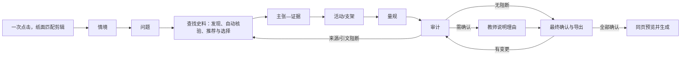

# 用户流程

> 状态：阶段 5 已批准归档
> 当前修订：2026-09-02 P09“装订清样 + 一次教师签发 + 同页打印”已实现
> 说明：每条 Must 均包含入口、步骤、反馈、成功和失败恢复；“未登录”是正常模式，“无权限”指非当前任务

## 1. 全局流程规则

1. 写操作第一次触发即锁定当前提交控件并显示进行中；重复点击不产生第二个操作。
2. 2 秒内显示已接收、校验错误或进行中；超过 30 秒显示耗时、取消和手工替代。
3. 外部失败只影响相关对象；教师已确认内容继续保留。未知、超时和离线从不显示为通过。
4. 上游改变前先展示影响；确认改变后，下游受影响项变为“待复核”。
5. 页面守卫和隐藏按钮只改善体验，不构成授权。完整模式的真实访问、修改、批准、导出、取消和清除必须由后续服务端再次授权。
6. P00 的 5—7 秒预渲染电影是无声增强层：王圆箓提灯进入、洞窟揭示和纸面匹配剪辑不承载任务信息；标题、边界和进入动作从第一帧可用。点击主动作只需一次并立即进入，不等待影片播完；不出现飞纸、白洗或二次确认。

## 2. MUST-001 教学情境采集

入口 P00 → P01。教师在常驻艺术/史料与演示数据边界旁一次点击进入“唐朝前期盛世”示范任务；敦煌画面不自动成为课程史料。P01 只填写学段、年级、教材、课次、分钟，可选课型与初步探究方向。右侧条件摘要即时更新，不需要生成。教师点击一次 `确认教学情境` 完成本步；P02 可用时直接进入 P02，阶段性 Demo 未实现 P02 时明确说明边界。正式问题在 P02 收束；史料条件在 P03 查找前确认；匿名学情在 P06 设计活动与支架时按需补充。

- 正常/成功：显示“教学情境已确认”，脉络带完成第 1 步。
- 未登录：不出现登录墙；只说明本机/临时保存边界。
- 无权限：统一进入 P12，不回显表单内容。
- 边界：0/负数/极长课时、初高中冲突、范围过大时阻止确认并给出缩小建议。
- 重复：确认中按钮显示“正在确认…”并禁用；重复点击不产生第二次确认。
- 失败/离线：保留全部输入；允许复制内容、重试或稍后继续。
- 恢复：重新编辑已确认情境时先列出问题、史料、活动和量规的潜在影响。

## 3. MUST-002 输入诊断与问题收束

入口 P01 成功 → P02。系统承接教学情境与初步方向，先给 2—3 个可直接采用的中心问题方案；只有缺失信息确实改变结果时才提出少量确认问题。教师选择或微调后确认并进入 P03，不需要完成长表单。

- 失败/超时：保留原输入，提供“手工写中心问题”和“重新诊断”。
- 边界：空、无意义字符、超长、答案预设或课时不可完成时提供具体修正，不生成假结果。
- 重复：新建议出现前保留当前确认版；差异并排展示后才替换。
- 恢复：否决建议不清空输入；返回情境时说明改变影响。
- 无权限/未登录：遵循全局规则。

## 4. MUST-003 候选史料发现与教师材料输入

入口 P02 成功 → P03。系统先从已登记轻量知识库发现史料，类型、观点或数量覆盖不足时再补充外部权威公开来源；发现结果先经过 MUST-004 基础自动核验。教师进入页面即看到可直接阅读的优先推荐和更多可用史料，每条同时说明推荐理由、可用于判断什么、不能单独证明什么、来源定位和权利限制。教师选择、排除或替换，不需要进入核验表单。

- 正常：目标 8—12 条可用候选，优先推荐 4—6 条；排序理由可读，不显示伪精确可信度分数。
- 空：区分知识库无覆盖、外部来源无可用结果和筛选后无匹配；提供调整问题、放宽非安全条件或录入有权材料元数据。
- 失败/超时：逐项失败，其他已核验结果继续可读；失败项不进入可用区，提供单项重试和手工路径。
- 边界：空/加密/不支持/疑似恶意或敏感文件被拒绝，安全原因不预览内容。
- 重复：同 URL、标识符或文件指纹显示“已在候选中”，不重复费用。
- 恢复：刷新/离线后恢复已完成候选与选择；正在上传的未完成文件需重新选择。

## 5. MUST-004 自动核验与问题相对价值/局限记录

MUST-004 不再拥有独立 P04 教师页面。系统在史料进入 P03 可用区前完成“出处与许可—原文与定位—加工边界—价值与局限”基础核验，并把结果嵌入史料卡、完整依据和后续审计。教师只需阅读、比较和取舍，仍保留替换、否决和最终批准权。

- 正常：P03 内定位可复制/打开，原文、节选、翻译、支架和 AI 内容标签并列可辨。
- 失败：链接失效、元数据冲突或引文不符时移出可用区，不保留“可用”状态。
- 边界：无作者、年代争议、多个版本、二手引文和许可不明可记录未知及路径，但不能跳过。
- 重复：重新核验不覆盖教师批注；冲突结果进入待复核。
- 恢复：教师补齐版本或替代来源后只重跑相关检查，已选其他史料保持不变。

## 6. MUST-005 主张—证据关系

入口已选择足够可用史料 → P05。教师创建/编辑核心主张，用表单选择史料、关系类型和理由；图形视图同步显示，等价列表为完整操作面。缺口、同源、冲突和过度概括有文本提示。

- 空/边界：零史料或零主张时显示安全入口；单一同源或未支持主张进入警告/阻断。
- 失败：自动建议失败不影响手工建关系。
- 重复：相同主张—史料—关系提示已存在，允许编辑原关系。
- 恢复：删除提供撤销；史料状态改变后相关活动/量规待复核。
- 键盘：不要求拖拽；“添加关系”对话框可完成全部动作。

## 7. MUST-006 活动与分层支架

入口 P05 → P06。教师编辑活动顺序、分钟、史料、学生操作、证据产物和对应困难；支架与困难维度关联。系统显示总时长与课时预算。

- 正常：每个核心活动都有证据依赖；总时长实时汇总。
- 失败：生成失败保留手工草稿并提供基于已确认关系的新建模板。
- 边界：课时过短、史料过长、无多类型证据、总时长超限时阻断审计，不以隐藏转场时间解决。
- 重复：重新生成先显示差异，不覆盖教师编辑。
- 恢复：可撤销最近删除；替换史料仅标记受影响活动。

## 8. MUST-007 评价量规

入口 P06 完成 → P07。系统从活动和证据产物形成四个默认维度；教师编辑等级与行为锚点，右侧/下方显示每维映射到哪个活动和证据产物。

- 空/失败：缺上游时不生成通用空壳，直接链接到缺失项。
- 边界：等级重叠、描述空泛、权重异常或删除全部证据维度时阻断。
- 重复：新版本以差异提案显示；确认前保留当前版。
- 恢复：上游变化后只重建受影响维度；误改可撤销。

## 9. MUST-008 全链路审计

入口 P07 → P08。页面直接读取当前问题、史料、论证、活动和量规，呈现预生成检查结果；教师不需要先点击“运行审计”。异常按来源、加工、证据、课堂、活动—评价、数据范围归类，已通过项收起，每项异常链接到具体对象。

- 正常：无阻断、未知和待确认后进入 P09；首选处理自动形成可编辑理由，理由须 10—500 字。
- 加载/超时：显示稳定骨架或明确未完成范围；保留已知结果，未知不通过。
- 失败：状态为“审计未完成”，绝不计算为通过。
- 重复：内容未变可显示复用时间；内容变更只复用不受影响项。
- 恢复：精确返回上游修复；重新进入后只重检受影响类别，其他教师处理继续保留。

## 10. MUST-009 审阅、批准与导出

入口 P08 完成 → P09“最终确认与导出”。P09 以连续装订清样呈现问题、史料、活动/支架、量规和设计检查，复用教师在上游已经作出的选择与确认，不要求重复逐项勾选。教师可随时返回上游查看或修改；只有实际内容变化才使旧签发失效并要求重检。上游决定全部有效时，教师在同页作一次最终签发，随后编辑安全文件名并打开浏览器打印预览；原 P10 不再是独立页面或步骤。

- 失败：本机确认保存或打印入口失败不改变上游决定，不显示文件已经生成。
- 边界：许可不允许复制时以元数据/链接替代并显著说明；零批准、待核验或缺项阻断。
- 重复：相同内容重复打开打印预览不外发、不收费，也不重复改变批准。
- 恢复：修改使旧“可试教候选”失效；重新审计和批准后再导出。
- 成功文案：“已打开系统打印窗口，请选择打印或另存为 PDF”；只有浏览器完成保存后文件才存在，不使用“已发布/已认证”。

## 11. MUST-010 临时数据、隔离与清除

入口 P00 提示、全局任务菜单 → P11。页面显示本机/临时边界、最后活动/预计失效（完整模式数据可用时）和数据范围。教师可清除单项上传或整任务；确认对话框列出受影响内容，整任务要求勾选理解而非输入复杂验证词。

- 正常：清除后进入 P12 `cleared`，焦点落在“新建演示任务”。
- 失败：不谎报成功；限制继续处理并提供重试/安全退出。
- 重复：重复清除返回同一安全结果，不泄露是否曾属于他人。
- 离线：Demo 本机清除应可执行；完整模式若无法确认服务端结果，显示“尚未确认清除完成”并停止继续操作。
- 恢复：主动清除或过期内容不提供普通恢复；瞬时失败只恢复最近安全状态。

## 12. 端到端成功与安全恢复

任何失败都回到最近安全状态；任何上游事实变化都沿箭头向后标记待复核，不自动删除教师内容。
