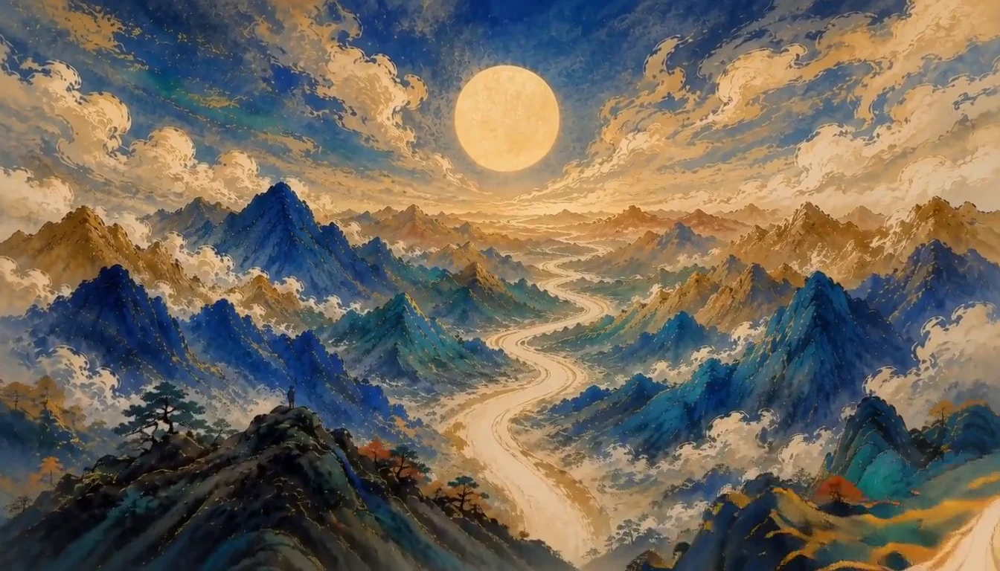

# 视觉方向与代表页视觉稿

> 当前修订：2026-09-05 P00 改为用户最终确认的明亮矿物色 H3 V2；P01—P09 工作台方向不变
> 状态：现役视觉总则
> 边界：视觉与交互设计；首页艺术层不构成史料或历史复原

## 1. 已确认的视觉命题

史证工坊不是仿古文化网站，也不是黑底荧光的 AI 工具。它采用两幕结构：

1. **证据苏醒**：首页以抽象笔锋进入明亮山河。朱砂红、钴蓝、青绿、暖金和象牙白形成第一眼冲击；视觉从收卷、加速前推到宏阔终帧，传达“重新打开证据”的动作，不讲述具体历史事件。
2. **证据工作**：进入任务后转为深色低干扰框架包围的纸面工作区，形成安静、清晰、可长时间阅读的史料阅览台。

一句话视觉原则：**以电影般的山河开场吸引注意，以安静的证据工作台完成判断。**

P00 的镜头、色彩与剪辑全部由预渲染成片承担。页面不使用 CSS 左右晃动、快速摇摆、缩放或粒子来伪造电影运镜，不再采用藏经洞、洞窟人物、旧黑金压暗画面或与现役影片不同风格的回退图。

## 2. 叙事与诚信边界

P00 是品牌艺术序章，不是当前课程的候选史料。抽象山河、笔锋、道路和日轮只表达探索、推进与视野打开；不得从画面推断朝代、地点、人物、事件或史实。

| 层 | 可以出现 | 必须说明 | 禁止 |
|---|---|---|---|
| AI 艺术层 | 笔锋、矿物色山河、光线、镜头和抽象空间 | 艺术化气氛、非史料 | 冒充历史照片、复原图、真实绘画或史料 |
| 真实史料 | 获许可的原文、实物图、馆藏图或必要短引 | 机构、定位、年代、材料性质和权利状态 | 许可不明却下载、热链或再发布 |
| UI 解释层 | 来源、核验、局限、批准和权利状态 | 使用真实文本与语义组件 | 把装饰图、颜色或 AI 推断当成核验结论 |

生成画面不得含可读或伪可读文字、印章、馆藏号和水印。真实史料始终只在独立证据组件中出现。

## 3. 签名元素

品牌层的签名语言是“笔锋打开证据路径”：开场笔锋先建立可理解的收卷因果，再把视点带入画面；中段沿道路加速；太阳、道路与蓝色山体承担构图匹配；结尾以稳定的山河全景完成视野打开。

光和颜色不承担业务信息，不产生“扫描认证”或事实结论。鼠标只可产生不移动镜头的轻微局部亮度回应；触屏和减少动态环境关闭。

## 4. 双场景颜色系统

### 4.1 P00 明亮电影层

| Token | 参考值 | 用途 |
|---|---|---|
| `film-cobalt` | `#174EA6` | 主山体与空间冷色 |
| `film-turquoise` | `#2C9B9B` | 中景层次与生命感 |
| `film-cinnabar` | `#D94B2B` | 开场笔锋与少量强记忆点 |
| `film-warm-gold` | `#E6B85C` | 日轮、云光和纵深连接 |
| `film-ivory` | `#F1E3C3` | 道路、云与高光 |
| `film-loading-blue` | `#315E75` | 媒体出现前的短暂安全底色 |

成片颜色原则是鲜明、丰富、有层次，不靠整体压黑获得“高级感”。页面只在顶部导航和底部信息轨附近加入局部透明暗层以保证文字可读，不覆盖画面主体。

### 4.2 低眩光史料阅览台

| Token | 参考值 | 用途 |
|---|---|---|
| `desk-frame` | `#16201F` | 低干扰外围框架与步骤索引 |
| `desk-canvas` | `#CFD1C9` | 主区周围的冷矿物灰 |
| `desk-surface` | `#E9E6DC` | 表单与连续阅读面 |
| `desk-raised` | `#F2EFE6` | 聚焦输入与对话框 |
| `desk-ink` | `#202725` | 主文本 |
| `desk-muted` | `#56605C` | 次要说明 |
| `desk-line` | `#9EA8A2` | 分隔与控件边界 |
| `action-blue` | `#1E5964` | 主操作、链接、当前步骤 |
| `verified-green` | `#276554` | 已核验或完成，必须配文字 |
| `review-ochre` | `#7B5A18` | 待复核或需确认 |
| `blocker-red` | `#9E3F45` | 阻断或危险 |
| `focus-violet` | `#654FD1` | 独立键盘焦点色 |

P01—P09 的正文与表单不使用黑底。状态色不能独立表达语义。

## 5. 字体与信息构图

- P00 展示标题：本地托管、按需字形切片的 `Noto Serif SC 500`，回退为系统宋体；标题自然分为“让沉睡千年的证据 / 重新开口”两行。
- 真实史料短引：系统宋体序列；不使用毛笔字或假碑刻字体。
- UI、正文、表单：系统无衬线中文字体。
- 馆藏号、年份、版本、页码：系统等宽字体，只承担坐标感。
- 首屏使用电影下三分之一信息轨：标题在左、用途在中、唯一入口在右，共享一条基线和细分隔线；窄屏改为单列。
- 工作台不沿用电影海报式大标题，信息密度依靠字号、间距和边界组织。

## 6. P00 非阻塞时序

| 时间 | 视觉与节奏 | 页面可用性 |
|---:|---|---|
| 0—1.4s | 多色笔锋形成环绕并自然收卷 | 品牌、任务入口、演示说明和主动作立即可用 |
| 1.4—4.0s | 镜头沿蓝绿河谷逐渐加速前推 | 不等待影片，不接收媒体交互 |
| 4.0s | 日轮、道路与蓝山完成直接构图匹配 | 无叠化、白洗或割裂跳切 |
| 4.0—6.4s | 继续加速并攀升至山脊 | 前进方向稳定，不左右晃动 |
| 6.4—7.5s | 宏阔山河与日轮打开，平顺减速 | 停在最后一帧并提供低权重重播 |

主动作任意时刻一次点击即进入 P01，不要求二次确认或等待影片。窄屏和 `prefers-reduced-motion` 显示从同一成片终帧提取的静态海报；解码失败同样回退该图。

## 7. 代表页视觉稿

### 7.1 P00 桌面与静态后备

验收重点：影片、海报与文字属于同一视觉世界；画面明亮丰富但文字仍清晰；没有旧主题残帧、方框 CTA、“跳过片头”、二次确认或 CSS 假运镜。媒体规格和来源以 `../06-development/P00-FINAL-ASSET-REGISTER.md` 为准。

### 7.2 P03 史料阅览与选择工作台

阶段 5 的 `workbench-desktop-v1.svg` 和 `workbench-mobile-v1.svg` 只保留历史评审价值。现役 P03 以 `P03-SOURCE-DISCOVERY-DESIGN.md` 和运行页面为准：桌面为目录、阅读、已选三栏；窄屏为目录、解读、已选页签；来源、许可、材料释义、可论证内容和局限始终可见。

## 8. 响应式与可访问性

- 影片和海报是装饰背景，空替代文本并从辅助技术顺序隐藏；真实内容与动作由 HTML 提供。
- 390px 与 320px 不产生页面级横向滚动；主动作至少 44px。
- 影片失败、自动播放失败或海报不可用不得阻断标题、Demo 边界和进入动作。
- `prefers-reduced-motion` 不加载动态影片；强制高对比可隐藏纯装饰背景。
- 焦点使用独立高对比轮廓，不只依赖颜色变化。

## 9. 自我批评与删减

- 风险：高饱和色变成廉价国风海报。约束：以大面积钴蓝和青绿稳定画面，朱砂只承担开场笔锋与少量焦点，暖金只连接日轮和云光。
- 风险：用户因晃动眩晕。约束：方向以前进为主，旋转和横移受限，速度变化连续，页面不叠加额外摄影机运动。
- 风险：开场吸入显得莫名其妙。约束：先让笔锋形成可见环绕关系，再逐步收卷，吸入动作必须有视觉因果。
- 风险：段落接缝割裂。约束：使用日轮、道路、山体和前进速度共同匹配，不用叠化掩盖不连续。
- 风险：生成场景被误认为史料。约束：艺术层不出现具体历史断言，真实史料只进入独立证据流程。
- 风险：电影感降低效率。约束：第一帧可操作，点击立即进入；媒体永不成为流程门槛。

## 10. 验证条件

必须验证媒体参数与无音轨、每次从头播放、终帧保持和重播、影片失败回退、窄屏与减少动态静态后备、构建产物无旧媒体、桌面/390px/320px 布局、控制台和网络请求，以及类型检查、规范检查、测试和生产构建。未亲测项目必须明确标记，不得以代码阅读冒充通过。
