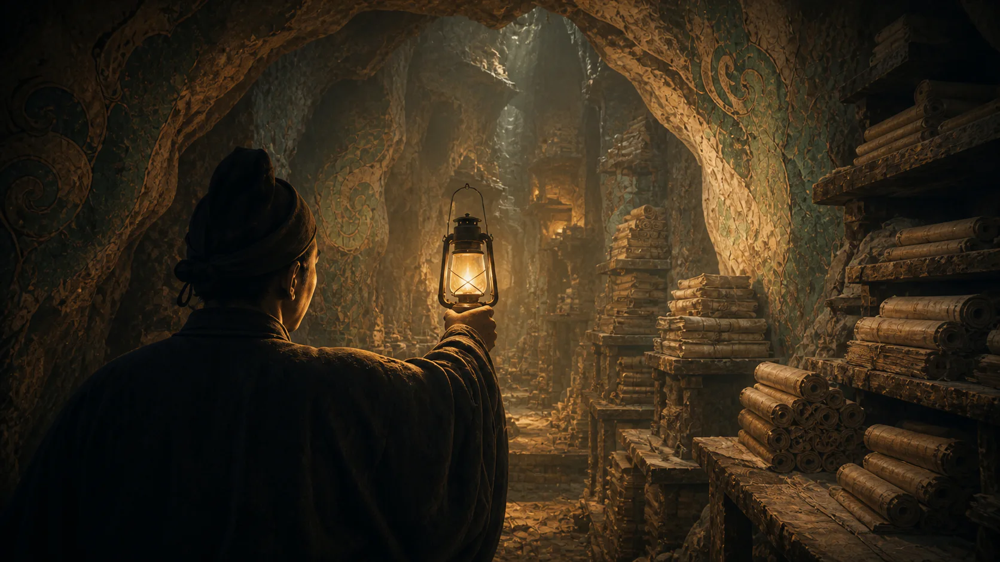
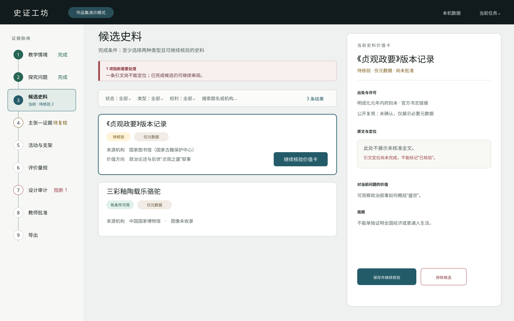
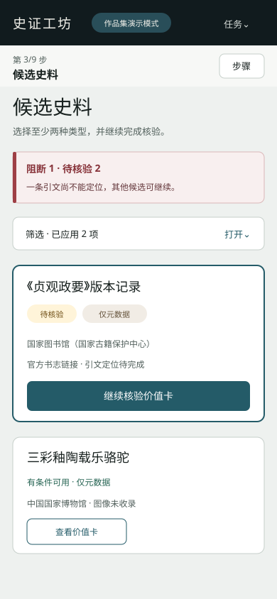

# 视觉方向与代表页视觉稿

> 版本：0.1
> 日期：2026-08-31
> 状态：阶段 5 已批准归档
> 边界：视觉与交互设计；不包含正式前端代码、数据库或具体后端 API

## 1. 已确认的视觉命题

史证工坊不是仿古文化网站，也不是黑底荧光的 AI 工具。它采用“两幕结构”：
1. **历史苏醒**：以敦煌藏经洞的艺术化电影场景为叙事锚点，用近黑石窟、矿物青绿、旧金灯光与人物空间制造第一眼惊喜；首屏不再叠加年份或地点标签。
2. **证据工作**：用户从第一帧即可操作；进入任务后转入深色低干扰框架包围的中低亮度阅读面，形成安静、低眩光、可长时间阅读的史料阅览台。

一句话视觉原则：**不是重演历史，而是让一件证据在黑暗中苏醒。**

用户于 2026-08-31 明确认可：敦煌藏经洞事件、震撼中带克制悲怆、人物不压过证据、近黑/群青/矿物青绿/旧金/少量朱砂，以及电影化但不阻塞使用的动画。2026-09-01 审美复核进一步否决浏览器实时纸片、粒子、鼠标光点与门户式转场，冻结为**预渲染动画电影**：王圆箓提灯进入，以敦煌壁画人物被现代 3D 动画重新唤醒为原创画风；摄影、角色、灯光和材质全部由成片承担，不采用真人写实画风，也不用 CSS 冒充电影镜头。

## 2. 叙事立场

情绪弧线采用“创造 → 封存 → 重现 → 流散 → 数字时代重新汇聚”。王圆箓是主要人物，但只作为复杂历史中的见证者：镜头以背影、肩后和短暂灯火侧影为主，不塑造成单一救世英雄或反派，也不确定未知相貌细节。文物流散只以少量远去纸页剪影和消失微光隐晦表达，不变成猎奇奇观。文书、版本、位置与流传关系才是贯穿千年的主角。

敦煌视觉具有中国史入口，但表达的是普遍人文主题：人如何记录、保存、误读、失去并重新理解过去。后续世界史内容不更换品牌系统，只替换证据对象和叙事材料。

P00 是品牌叙事序章，不是当前课程的第一份候选史料。进入任务时必须明确显示示范课标题和中心问题，不能让用户误以为敦煌材料属于“唐朝前期盛世”fixture；只有经教师主动纳入并完成核验的材料才能进入证据链。

## 3. 史实、史料与艺术层必须分开

| 层 | 可以出现 | 必须标注 | 禁止 |
|---|---|---|---|
| 历史事实 | 1900 年、藏经洞、文献时代范围等经权威来源核对的事实 | 来源、访问日；有争议时写明争议 | 用生成画面补足未知日期、人物相貌或现场细节 |
| 真实史料 | 获许可的文书、馆藏图、照片或必要短引 | 收藏机构、编号、年代、权利状态、同期/后世性质 | 许可不明却下载、热链、裁切再发布 |
| AI 艺术层 | 光线、镜头、人物姿态、跨时代视觉融合 | 常驻或可展开的“艺术化演绎” | 称为现场照片、复原史料、真实壁画或历史引文 |
| UI 解释层 | 年代、来源类型、核验/权利/批准状态 | 使用真实文本与语义组件 | 把装饰性伪文字当作内容 |

当前官方资料对发现具体日期存在不同表述，首屏只显示“1900”，不在核对完成前给出月日。可采用的事实依据包括[中国政府网的藏经洞发现记录](https://www.gov.cn/lssdjt/content_657373.htm)与[敦煌文博会官方资料](https://www.gswbj.gov.cn/a/2025/06/30/25192.html)。视觉稿不是上述来源的替代品。

## 4. 签名元素：证据光路

原“证据脉络带”保留为工作台导航；品牌层的唯一签名语言是灯火揭示：影片以纸面匹配剪辑进入工作台，真实标题用一次短促显影回应画面曝光。光不是魔法，不产生“扫描认证”或事实结论；不得叠加装饰粒子、漂浮纸片、门户光圈、循环发光或无场景因果的彩蛋。

编码规则：光路与 3D 场景不承载业务信息；真实内容和主操作从首帧可用。桌面鼠标只产生有边界的摄像机微位移和前/中/后景差速，不做自由漫游或持续追随鼠标的高成本光斑；指针经过人物、壁画或经卷时只能得到轻微光线回应，不能弹出说明或形成寻物游戏。完整分层与降级见 `HYBRID-3D-OPENING-SPEC.md`。

## 5. 双场景颜色系统

### 5.1 叙事暗场

| Token | Hex | 用途 |
|---|---|---|
| `narrative-void` | `#080D0F` | 洞窟暗部与首屏基底 |
| `narrative-ink` | `#111B1E` | 暗场表面 |
| `mineral-blue` | `#294E59` | 群青矿物冷光 |
| `mineral-green` | `#496B62` | 壁画青绿与次级光 |
| `lamp-gold` | `#C5A46A` | 灯光、时间坐标；不可用于长正文 |
| `cinnabar-mark` | `#A94B42` | 极少量证据标记；不作大面积中国红 |
| `narrative-text` | `#F2F1EA` | 暗场标题与正文 |

### 5.2 低眩光史料阅览台

| Token | Hex | 用途 |
|---|---|---|
| `desk-frame` | `#16201F` | 低干扰外围框架与步骤索引；不承载长正文 |
| `desk-canvas` | `#CFD1C9` | 主区周围的冷矿物灰，压低屏幕总亮度 |
| `desk-surface` | `#E9E6DC` | 无纹理中低亮度阅读面；用于表单与简报 |
| `desk-raised` | `#F2EFE6` | 聚焦输入与对话框；禁止纯白大面积铺底 |
| `desk-ink` | `#202725` | 主文本；避免纯黑造成过强反差 |
| `desk-muted` | `#56605C` | 次要说明 |
| `desk-line` | `#9EA8A2` | 分隔与控件边界 |
| `action-blue` | `#1E5964` | 主操作、链接、当前步骤 |
| `verified-green` | `#276554` | 已核验/完成；必须配文字 |
| `review-ochre` | `#7B5A18` | 待复核/需确认 |
| `blocker-red` | `#9E3F45` | 阻断/危险 |
| `focus-violet` | `#654FD1` | 独立键盘焦点色 |

叙事暗场只在 P00、极短转场和工作台外围框架出现；P01—P11 的正文与表单不使用黑底。P01 的视觉隐喻是低眩光史料阅览台：外围深色负责聚焦，中低亮度无纹理表面负责阅读，矿物色只负责结构联系。状态色不随暗/亮主题改变语义。

## 6. 字体与文字气质

- P00 展示标题：本地托管、按需字形切片的 `Noto Serif SC 500`，回退为 `"Songti SC", "STSong", SimSun, serif`。只覆盖首屏标题所需字形，不阻塞影片或入口；许可文件与字体资产一同登记。
- 真实史料短引：`"Songti SC", "STSong", "Noto Serif CJK SC", SimSun, serif`。不使用毛笔字或假碑刻字体。
- UI、正文、表单：`system-ui, "Microsoft YaHei", "PingFang SC", "Noto Sans CJK SC", sans-serif`。
- 馆藏号、年份、版本、页码：系统等宽字体，仅承担坐标感。
- 首屏采用电影片尾字幕式下三分之一信息轨：标题在左、用途说明居中、唯一入口在右，三者共享一条基线与细分隔线。标题自然分为“让沉睡千年的证据 / 重新开口”两行，同字号同颜色，不做两端对齐；入口是透明文字动作与旧金细底线，不使用卡片式方框。
- 工作台不沿用电影海报式大标题；信息密度由字号、间距和边界组织，不靠装饰字体。

## 7. P00 非阻塞预渲染电影时序

| 时间 | 视觉与节奏 | 页面可用性 |
|---:|---|---|
| 0—1.5s | 静态安全帧与真实 UI 立即显示；黑暗中灯火出现，王圆箓从背后进入 | 全部可点击、可滚动、可键盘操作 |
| 1.5—3.5s | 肩后镜头缓慢前推；灯光揭示洞窟纵深，经卷和壁画人物产生极弱苏醒感 | 鼠标只做克制视差；用户操作即自然收束 |
| 3.5—5s | 少量远去纸页剪影和消失微光隐晦表达流散 | 不弹热点、不显示生成文字或假史料 |
| 5—7s | 摄影机逼近有实体支撑的展开纸面，纸面占满画幅并匹配到工作台 | 不等待结束；点击立即进入，不叠飞纸或光洗 |
| 7s 后 | 动态终态只保留极弱灯火、尘埃和空间呼吸，不循环人物动作 | 页面稳定优先，后台标签暂停 |

主动作任意时刻一次点击即进入，不要求二次确认或等待影片；浏览器原生页面过渡只做短促匹配剪辑，不增加独立叙事层。`prefers-reduced-motion: reduce` 时直接显示静态关键帧并立即切页。影片、静态海报和纯色安全首屏组成降级梯，任何一级都保留同一真实 UI。

## 8. 无声视觉原则

产品全程无声，不包含环境声、音乐、旁白、音效或声音控件。史诗感只通过成片中的分段推镜、灯火揭示、洞窟纵深和纸面匹配剪辑建立；这同时减少自动播放、打扰、后台播放和音频许可风险。

## 9. 代表页视觉稿

### 9.1 P00 桌面首屏

验收重点：艺术层与文字层分开；下三分之一信息轨在宽屏形成一个整体，标题、用途与入口不再散落为三个视觉孤岛；第一帧即可一次点击进入任务；首屏不显示年份、地点或冗长艺术声明，诚信边界收进可访问的低干扰“演示说明”；不存在方框 CTA、“跳过片头”或二次确认门槛。成片、回退和最终视觉门以 `HYBRID-3D-OPENING-SPEC.md` 为准。

### 9.2 P03/P04 桌面证据工作台

验收重点：进入主任务后视觉降噪；证据脉络带、候选列表和当前价值卡形成稳定上下文；来源、权利和核验状态是一级信息。

### 9.3 P03 手机窄屏

验收重点：单列仍保留状态、许可和阻断；没有把桌面三栏缩小；主动作不遮挡内容与焦点。

这些 SVG 是设计验证稿，不是上线截图。背景艺术稿见 [`assets/dunhuang-hero-art-direction-v1.png`](./assets/dunhuang-hero-art-direction-v1.png)，其性质与限制记录在 [`assets/README.md`](./assets/README.md)。

## 10. 自我批评与删减

- 风险：敦煌画面容易变成“国风旅游宣传片”。修订：不使用大红金、宫殿、祥云、巨型帝王正脸；把视觉高潮落在证据坐标而不是文化符号堆叠。
- 风险：生成场景可能被误认作史料。修订：艺术标签常驻；真实史料始终在独立证据组件中出现；生成图内不允许可读文字。
- 风险：电影感降低效率。修订：内容首帧可用、动画层不接收操作、滚动即收束、仅 P00 使用暗场。
- 风险：声音打扰教师或制造不必要的自动播放问题。修订：项目全程无声并删除音频资产、控件和偏好。
- 风险：3D 变成技术炫技或游戏开场。修订：正式体验只保留预渲染导演镜头和一次纸面匹配剪辑；没有实时纸片、自由漫游、热点弹窗、寻物任务或全站视差。
- 风险：关键帧被误当成电影成片。修订：完成门必须存在真实 5—7 秒视频并单独验收镜头、角色与剪辑；CSS 缩放和图片轮播不能替代。

## 11. 阶段 6 验证条件

阶段 6 必须用实际浏览器和设备验证首屏可交互时间、影片/海报/纯色降级、媒体资源体积与解码、一次点击、5—7 秒影片不阻塞、纸面匹配剪辑、后台暂停、reduced-motion、暗场文字对比、320px 独立构图和 200%/400% 缩放。任何一项影响主任务时，先降级媒体，不改变核心工作流。
