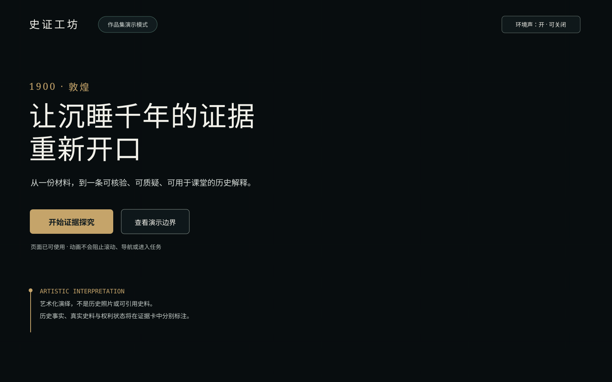

# 视觉方向与代表页视觉稿

> 版本：0.1
> 日期：2026-08-31
> 状态：阶段 5 已批准归档
> 边界：视觉与交互设计；不包含正式前端代码、数据库或具体后端 API

## 1. 已确认的视觉命题

史证工坊不是仿古文化网站，也不是黑底荧光的 AI 工具。它采用“两幕结构”：
1. **历史苏醒**：以 1900 年敦煌藏经洞重现于世为叙事锚点，用近黑石窟、矿物青绿、旧金灯光、人物与残卷交融的电影化画面制造第一眼惊喜。
2. **证据工作**：用户从第一帧即可操作；随着滚动或进入任务，暗部自然退场，界面转入明亮、克制、适合长时间阅读的证据工作台。

一句话视觉原则：**不是重演历史，而是让一件证据在黑暗中苏醒。**

用户于 2026-08-31 明确认可：敦煌藏经洞事件、震撼中带克制悲怆、人物不压过证据、近黑/群青/矿物青绿/旧金/少量朱砂，以及电影化但不阻塞使用的动画。随后确认将 P00 升级为**混合 3D**：王圆箓提灯进入，以敦煌壁画人物被现代 3D 动画重新唤醒为原创画风；高质量预渲染人物/主镜头与实时空间、灯火、尘埃、微视差和残卷转场结合，不采用真人写实画风。

## 2. 叙事立场

情绪弧线采用“创造 → 封存 → 重现 → 流散 → 数字时代重新汇聚”。王圆箓是主要人物，但只作为复杂历史中的见证者：镜头以背影、肩后和短暂灯火侧影为主，不塑造成单一救世英雄或反派，也不确定未知相貌细节。文物流散只以少量远去纸页剪影和消失微光隐晦表达，不变成猎奇奇观。文书、版本、位置与流传关系才是贯穿千年的主角。

敦煌视觉具有中国史入口，但表达的是普遍人文主题：人如何记录、保存、误读、失去并重新理解过去。后续世界史内容不更换品牌系统，只替换证据对象和叙事材料。

P00 是品牌叙事序章，不是当前课程的第一份候选史料。进入任务时必须明确显示示范课标题和中心问题，不能让用户误以为敦煌材料属于“唐朝前期盛世”fixture；只有经教师主动纳入并完成核验的材料才能进入证据链。

## 3. 史实、史料与艺术层必须分开

| 层 | 可以出现 | 必须标注 | 禁止 |
|---|---|---|---|
| 历史事实 | 1900 年、藏经洞、文献时代范围等经权威来源核对的事实 | 来源、访问日；有争议时写明争议 | 用生成画面补足未知日期、人物相貌或现场细节 |
| 真实史料 | 获许可的文书、馆藏图、照片或必要短引 | 收藏机构、编号、年代、权利状态、同期/后世性质 | 许可不明却下载、热链、裁切再发布 |
| AI 艺术层 | 光线、镜头、人物姿态、跨时代视觉融合 | 常驻或可展开的“艺术化演绎” | 称为现场照片、复原史料、真实壁画或历史引文 |
| UI 解释层 | 年代、来源类型、核验/权利/批准状态 | 使用真实文本与语义组件 | 把装饰性伪文字当作内容 |

当前官方资料对发现具体日期存在不同表述，首屏只显示“1900”，不在核对完成前给出月日。可采用的事实依据包括[中国政府网的藏经洞发现记录](https://www.gov.cn/lssdjt/content_657373.htm)与[敦煌文博会官方资料](https://www.gswbj.gov.cn/a/2025/06/30/25192.html)。视觉稿不是上述来源的替代品。

## 4. 签名元素：证据光路

原“证据脉络带”保留为工作台导航；品牌层新增但不重复的签名动作“证据光路”：灯火与残卷转场把宏大叙事收束到明亮工作台中的真实元数据坐标——年代、馆藏号、页/段、版本和状态。光不是魔法，不产生“扫描认证”或事实结论；少量尘埃只表达空间，不编码信息。

编码规则：光路与 3D 场景不承载业务信息；真实内容和主操作从首帧可用。桌面鼠标只产生有边界的摄像机微位移和前/中/后景差速，不做自由漫游或持续追随鼠标的高成本光斑；指针经过人物、壁画或经卷时只能得到轻微光线回应，不能弹出说明或形成寻物游戏。完整分层与降级见 `HYBRID-3D-OPENING-SPEC.md`。

## 5. 双场景颜色系统

### 5.1 叙事暗场

| Token | Hex | 用途 |
|---|---|---|
| `narrative-void` | `#080D0F` | 洞窟暗部与首屏基底 |
| `narrative-ink` | `#111B1E` | 暗场表面 |
| `mineral-blue` | `#294E59` | 群青矿物冷光 |
| `mineral-green` | `#496B62` | 壁画青绿与次级光 |
| `lamp-gold` | `#C5A46A` | 灯光、时间坐标；不可用于长正文 |
| `cinnabar-mark` | `#A94B42` | 极少量证据标记；不作大面积中国红 |
| `narrative-text` | `#F2F1EA` | 暗场标题与正文 |

### 5.2 明亮工作台

| Token | Hex | 用途 |
|---|---|---|
| `desk-canvas` | `#EEF1EF` | 页面背景；冷淡石色，不模拟羊皮纸 |
| `desk-surface` | `#FBFCFA` | 主表面 |
| `desk-raised` | `#FFFFFF` | 对话框与聚焦卡片 |
| `desk-ink` | `#18211F` | 主文本 |
| `desk-muted` | `#52605C` | 次要说明 |
| `desk-line` | `#C6CFCA` | 分隔与控件边界 |
| `action-blue` | `#245B68` | 主操作、链接、当前步骤 |
| `verified-green` | `#276554` | 已核验/完成；必须配文字 |
| `review-ochre` | `#7B5A18` | 待复核/需确认 |
| `blocker-red` | `#9E3F45` | 阻断/危险 |
| `focus-violet` | `#654FD1` | 独立键盘焦点色 |

叙事暗场只在 P00 和极短转场出现；P01—P11 不使用大面积黑底。状态色不随暗/亮主题改变语义。

## 6. 字体与文字气质

- 展示标题与真实史料短引：`"Songti SC", "STSong", "Noto Serif CJK SC", SimSun, serif`。标题使用大字号、较松字距和克制行数，不使用毛笔字或假碑刻字体。
- UI、正文、表单：`system-ui, "Microsoft YaHei", "PingFang SC", "Noto Sans CJK SC", sans-serif`。
- 馆藏号、年份、版本、页码：系统等宽字体，仅承担坐标感。
- 首屏标题建议：“让沉睡千年的证据重新开口”；副标题：“从一份材料，到一条可核验、可质疑、可用于课堂的历史解释。”
- 工作台不沿用电影海报式大标题；信息密度由字号、间距和边界组织，不靠装饰字体。

## 7. P00 非阻塞混合 3D 时序

| 时间 | 视觉/声音 | 页面可用性 |
|---:|---|---|
| 0—1.5s | 静态安全帧与真实 UI 立即显示；黑暗中灯火出现，王圆箓从背后进入 | 全部可点击、可滚动、可键盘操作 |
| 1.5—3.5s | 肩后镜头缓慢前推；灯光揭示洞窟纵深，经卷和壁画人物产生极弱苏醒感 | 鼠标只做克制视差；用户操作即自然收束 |
| 3.5—5s | 少量远去纸页剪影和消失微光隐晦表达流散 | 不弹热点、不显示生成文字或假史料 |
| 5—7s | 一卷无文字残卷向镜头展开，纤维纸面变亮并转化为工作台 | 不等待结束；进入/滚动/导航直接同步到末帧 |
| 7s 后 | 动态终态只保留极弱灯火、尘埃和空间呼吸，不循环人物动作 | 页面稳定优先，后台标签暂停 |

第一次访问且能力允许时只播放一次完整镜头；再次访问停在动态终态，并提供次要“重看序章”入口。`prefers-reduced-motion: reduce` 时直接显示最终静态关键帧，不做推镜、视差、漂浮纸页或自动转场。完整 3D、轻量动态、静态终帧和纯色安全首屏组成四级降级梯，任何一级都保留同一真实 UI。

## 8. 环境声

- 产品意图：默认开启极轻环境声，内容仅含远风、纸张、衣料、木石空间感；无旁白、无突然鼓点、无循环宏大配乐、无宗教诵唱采样。
- 浏览器允许时以极低音量开始；若有声自动播放被阻止，则首屏仍正常，第一次用户点击/触摸/按键后再尝试启声，失败不提示错误弹窗。
- 首屏顶部始终有文字可识别的“环境声：开/关”按钮；关闭后记住本机偏好。页面进入后台、系统省电或用户开始播放其他媒体时暂停。
- 声音不是信息通道；静音用户不会缺失内容。音频许可、体积和循环接缝须在阶段 6 验证，未批准素材不得进入仓库。

浏览器通常会阻止用户尚未交互时的有声自动播放，因此“默认开启”是产品偏好，而不是保证每台设备打开即响的技术承诺；实现必须安全处理播放失败。[MDN 自动播放指南](https://developer.mozilla.org/en-US/docs/Web/Media/Guides/Autoplay)

## 9. 代表页视觉稿

### 9.1 P00 桌面首屏

验收重点：该图只代表文字层级与第二关键帧构图，不是假装已经完成 3D；艺术层与文字层分开；第一帧即可进入任务；演示模式、艺术化演绎和声音控制可见；不存在“跳过片头”门槛。混合 3D 镜头、分层、重复访问和双门禁以 `HYBRID-3D-OPENING-SPEC.md` 为准。

### 9.2 P03/P04 桌面证据工作台

验收重点：进入主任务后视觉降噪；证据脉络带、候选列表和当前价值卡形成稳定上下文；来源、权利和核验状态是一级信息。

### 9.3 P03 手机窄屏

验收重点：单列仍保留状态、许可和阻断；没有把桌面三栏缩小；主动作不遮挡内容与焦点。

这些 SVG 是设计验证稿，不是上线截图。背景艺术稿见 [`assets/dunhuang-hero-art-direction-v1.png`](./assets/dunhuang-hero-art-direction-v1.png)，其性质与限制记录在 [`assets/README.md`](./assets/README.md)。

## 10. 自我批评与删减

- 风险：敦煌画面容易变成“国风旅游宣传片”。修订：不使用大红金、宫殿、祥云、巨型帝王正脸；把视觉高潮落在证据坐标而不是文化符号堆叠。
- 风险：生成场景可能被误认作史料。修订：艺术标签常驻；真实史料始终在独立证据组件中出现；生成图内不允许可读文字。
- 风险：电影感降低效率。修订：内容首帧可用、动画层不接收操作、滚动即收束、仅 P00 使用暗场。
- 风险：环境声冒犯或打扰。修订：极低音量、显式关闭、记忆偏好、无突然声响，并接受浏览器阻止自动播放。
- 风险：3D 变成技术炫技或游戏开场。修订：只保留导演式镜头、微视差、受控灯火/尘埃和一次残卷转场；没有自由漫游、热点弹窗、寻物任务或全站视差。
- 风险：实时人物质量不足。修订：人物与主镜头优先预渲染，实时能力只投入空间回应；技术原型与最终视觉分别验收。

## 11. 阶段 6 验证条件

阶段 6 先通过技术原型门，再通过最终视觉验收门。必须用实际浏览器和设备验证首屏可交互时间、3D/媒体失败四级降级、资源体积、帧率/卡顿、鼠标与触摸视差、镜头收束、首次/再次访问、重看、低端设备滚动、5—7 秒动画不阻塞、自动播放失败、声音开关、后台暂停、reduced-motion、暗场文字对比、320px 裁切和 200%/400% 缩放。任何一项影响主任务时，先降级 3D、动效与音频，不改变核心工作流。
