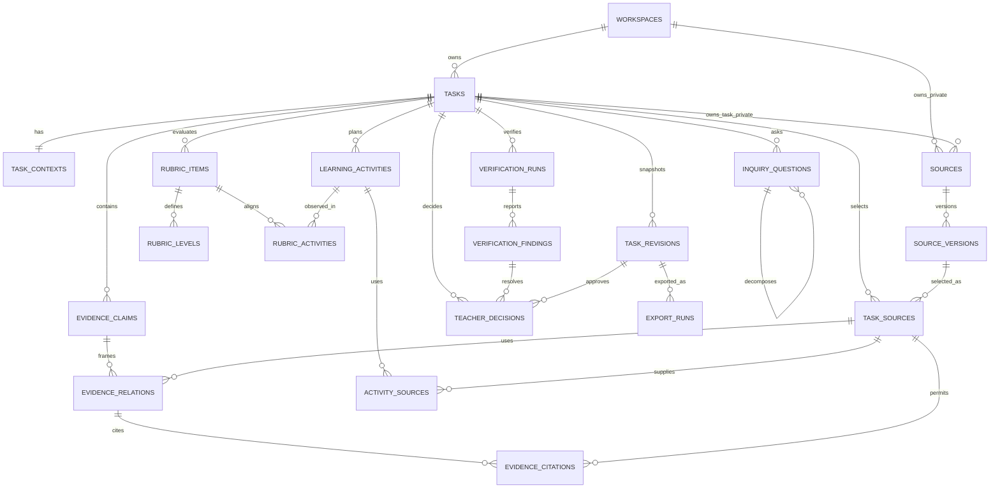
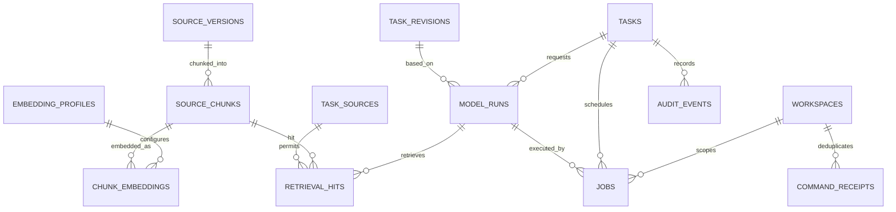

# 史证工坊数据库 ERD

> 文档版本：0.1
> 更新日期：2026-09-03
> 状态：阶段 7 已批准归档
> 说明：图展示领域关系，不代表前端页面或 HTTP 路径

## 1. 核心领域关系

## 2. RAG 与运行关系

LangGraph checkpointer 使用独立 `agent` schema，由固定版本的 checkpointer migration 管理；它不反向成为 `core` 真相源，也不对其内部表建立领域外键。`model_runs.external_thread_id` 只保存非秘密关联标识，任务硬删时先删除对应 checkpoint，再删除 task。

## 3. 通俗解释

1. 一次本地安装只有一个 workspace；workspace 是未来扩展账号或团队时的隔离接缝。
2. task 保存教师当前工作的关系化版本，也保留关键时刻的不可变快照。
3. source 是“哪份材料”，source version 是“这次实际看见并引用的具体版本”。旧任务不会因网页后来变化而悄悄改变。
4. task source 是任务对史料版本的授权清单。证据和活动只能引用清单内版本。
5. source chunk 是可精确定位的片段；embedding 只是它的可重建索引，不是史料本体。
6. model run 保存一次 AI 操作使用了哪个任务版本；retrieval hit 证明它实际看过哪些片段。
7. export run 指向不可变 task revision，所以能回答“这个 DOCX/PDF 当时包含哪一版内容”。

## 4. 删除方向

- task 硬删：级联当前领域子项、私有 source、revision、run、hit、job、export 和 task 内容性 audit。
- 公共 source/version：被引用时 `RESTRICT`，仅允许退役；不能因一个 task 删除而消失。
- source version 硬删：仅限未被 task/revision/citation 使用且经迁移或受控维护操作。
- embedding profile：被向量使用时 `RESTRICT`；替换模型通过新增 profile 完成。
- workspace：当前不向普通应用提供删除；本地完全重置使用受控数据库重建流程。

## 5. 图中没有的关系

页面路由、按钮状态、IndexedDB store、API endpoint、GLM 请求对象和厂商响应都不属于 ERD。前端 `taskId` 只定位；本地 workspace 由服务端运行配置确定。未来线上身份、分享或学校组织必须新增经批准的身份 ERD，不能把 task ID 改造成授权凭证。
